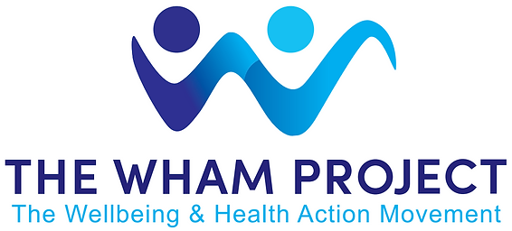

# RCPCH Health Inequalities App

This was originally created as a partner app for the WHAM project. WHAM stands for Wellbeing and Health Action Movement.

WHAM was created by a small group of paediatricians to support other paediatricians to manage the social determinants of ill health seen in young patients and their families. More information on WHAM can be found [here](https://www.whamproject.co.uk/the-social)




## Getting Started

The RCPCH Health Inequalities App is a Flutter 3.3 project, written in Dart. Flutter is a mobile application development framework which allows us to develop in a single codebase and from this deploy native apps for iOS, Android, web and desktop.

## Local development setup

1. Download flutter and Dart with dependencies (iOS and Android SDKs) [here](https://docs.flutter.dev/get-started/install). You will need to create a virtual device to demo the app on, or connect a real device.

1. Clone this repository

```shell
git clone https://github.com/rcpch/rcpch-wham
```

```shell
cd rcpch-wham
```

1. Install dependencies

```shell
flutter pub get
```

1. Run the application

```shell
flutter run
```

The app has been tested on:

- iOS (@eatyourpeas)
- Android (@pacharanero)
- Linux Desktop (@pacharanero)


## Some installation notes

- If your Dart SDK isn't the correct version (at the time of writing it needs to be >2.18.2) then you can run `flutter upgrade` to update both Flutter and Dart. For some reason this was even required on a new install of Flutter in one case.

- The Android Virtual Device Manager defaults to a very low amount of disk space for virtual Android devices, and quite often this disk space is insufficient to actually load an app into, causing failure of the app to run. There will be a 'not enough disk space' or similar error. To increase disk space, you can Edit the Virtual Device in Android Studio, select 'Advanced' and increase the device disk storage to something bigger.
